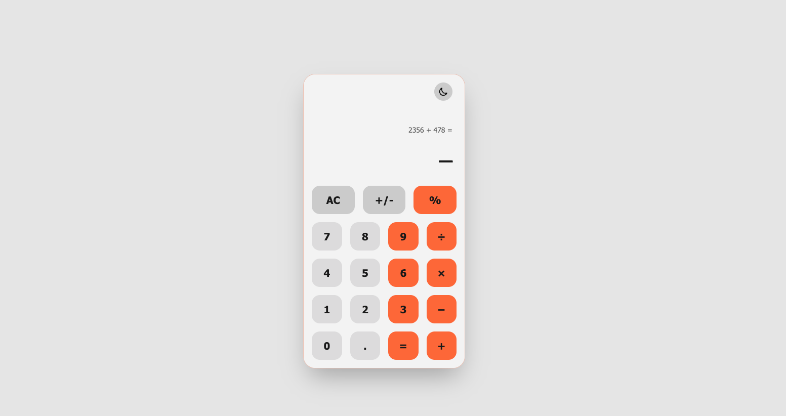
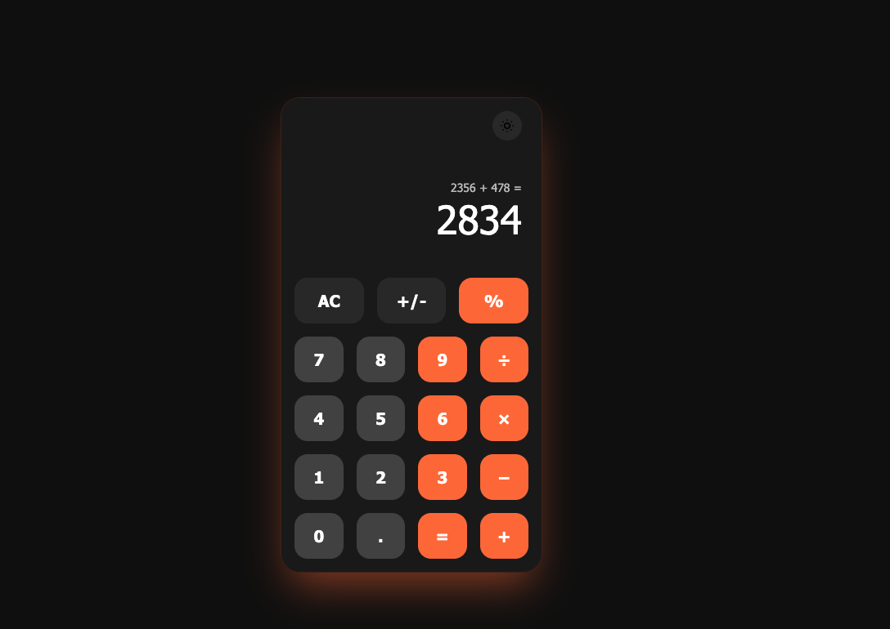

# AI-Calculator

A modern calculator application built with React, using Clean Architecture and VIPER architecture patterns.





## Table of Contents

1. [Architecture](#architecture)
2. [VIPER Architecture](#viper-architecture)
3. [Project Structure](#project-structure)
4. [Data Flow](#data-flow)
5. [Getting Started](#getting-started)

---

## Architecture

This project follows **Clean Architecture** principles, implementing the **VIPER** pattern. These architectures are **framework-agnostic** — they can be applied to any framework or library (React, Angular, Vue, iOS, Android, etc.) because they define patterns for organizing code based on separation of concerns, not specific framework features.

### Why VIPER?

- **Separation of concerns** — Each component has a single responsibility
- **Testability** — Easy to unit test each layer independently
- **Scalability** — New features can be added without breaking existing code
- **Maintainability** — Code is organized in a predictable way

---

## VIPER Architecture

VIPER is a Clean Architecture implementation with 5 layers:

### V - View
- UI components only
- No business logic
- Communicates with Presenter
- Handles user events

### I - Interactor
- Pure business logic
- No UI knowledge
- Handles use cases
- Mathematical operations

### P - Presenter
- Coordinates View and Interactor
- Prepares data for the view
- Handles UI events
- Contains presentation logic

### E - Entity
- Data models
- Domain objects

### R - Router
- Navigation between screens
- Handles transitions and parameters

---

## Project Structure

```
src/
├── presentation/calculator/
│   ├── view/
│   │   ├── CalculatorView.jsx    # Main container
│   │   ├── Display.jsx           # Result display
│   │   ├── Button.jsx           # Individual button
│   │   ├── ButtonGrid.jsx       # Button layout
│   │   ├── Header.jsx           # Header with theme toggle
│   │   └── ThemeToggle.jsx      # Light/dark mode toggle
│   ├── interactor/
│   │   └── CalculatorInteractor.js  # Math operations
│   └── presenter/
│       └── CalculatorPresenter.js    # State coordination
├── core/constants/
│   └── calculator.constants.js   # Colors, buttons, themes
└── domain/entities/
    └── calculation.entity.js    # Data models
```

---

## Features

- **Arithmetic Operations**: Addition, subtraction, multiplication, division
- **Operation Chaining**: Multiple operations in sequence (e.g., 5 + 3 − 2)
- **Percentage**: Calculate percentages (%)
- **Sign Toggle**: Change positive/negative (+/-)
- **Clear All**: Reset calculator (AC)
- **Error Handling**: Division by zero displays "Error"
- **Light/Dark Mode**: Toggle between themes with sun/moon icons
- **Animated Cursor**: Blinking underscore cursor in display

---

## Getting Started

```bash
# Install dependencies
npm install

# Start development server
npm start

# Run tests
npm test

# Build for production
npm run build
```

## Tech Stack

- **React** — UI Library
- **JavaScript** — Language
- **Create React App** — Build tool
- **Tailwind CSS** — Styling
- **VIPER** — Architecture pattern
- **Clean Architecture** — Design principles
